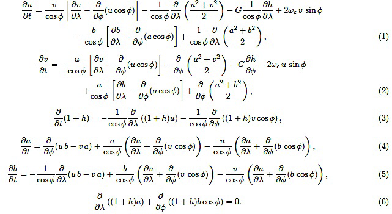

# MHD Shallow Water Model

A shallow water model is a quasi-three-dimensional fluid system - in
the case of the Sun the fluid is magnetized solar plasma. Therfore, for 
the Sun, a shallow water model is an MHD (magnetohydrodynamic) shallow water
model (MHD-SW Model), which is generalized to include magnetic fields into
a version of hydrodynamic shallow water model. For simulating Earth's atmospheric 
and oceanic global dynamics, a hydrodynamic shallow water models and codes
exist. By contrast, for the Sun, global dynamics is majorly governed by its 
strong magnetic fields. Hence an MHD-SW model is relatively new, and got
started being developed only about two and a half decades ago. 

Like hydrodynamic shallow water model, MHD-SW model also includes the 
radial dimension of a thin fluid shell in the Sun in a simplified way, by 
allowing the upper boundary to vary in latitude, longitude and time, so
that radial motions can occur and the thickness of the fluid shell can vary. 
The core approximation is that the horizontal scale of fluid and the 
disturbances in it are very large compared to the undisturbed thickness of 
the fluid, so the pressure perturbations are hydrostatic. Due to the thinness 
of the layer compared to solar radius the divergence of the radii and the 
density variation are ignored in the momentum and mass continuity equations. 
While the details about the full set of non-linear MHD shallow water 
equations can be found in Dikpati et al. (2018, ApJ), those equations
in non-dimensional form in the rotating frame (rotating with the Sun’s 
core-rotation rate) are given below:

[Movie for magnetic bands' interaction](https://drive.google.com/file/d/1toZKZIyqqZWeIszP7UeLdaFMiiijB_mp/view?usp=sharing)

## References:
